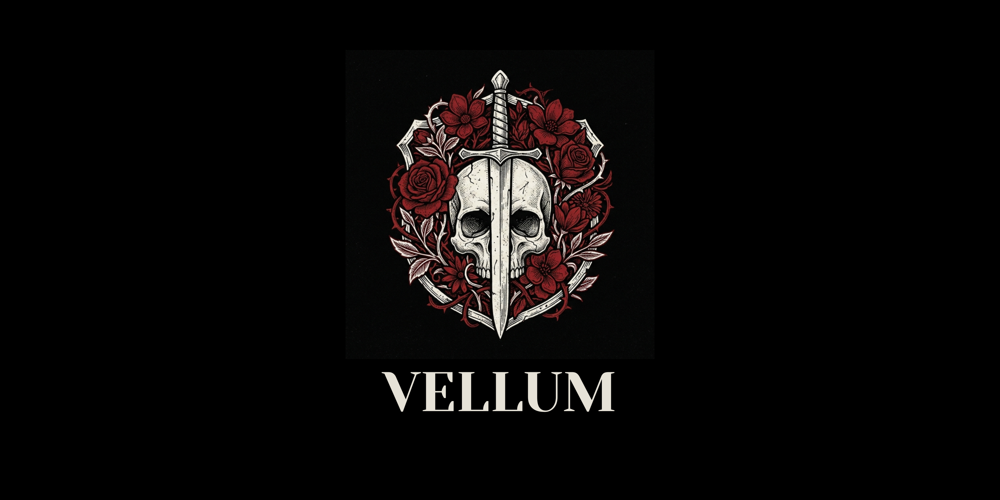

# 💎 Vellum: High-Performance Virtualization Engine





[](https://isocpp.org/)
[](LICENSE)
[](https://www.kernel.org/doc/html/latest/virt/kvm/index.html)
[](#)

A lightweight VM manager built with C++20, providing a browser-based GUI for creating, monitoring, and managing micro-VMs using Linux KVM.

## Requirements

- **Operating System**: Linux (KVM requires Linux kernel support)
- **Hardware**: CPU with virtualization extensions (VT-x/AMD-V)
- **Software**: 
  - C++20 compiler (GCC 10+ or Clang 12+)
  - CMake 3.16+
  - Crow C++ web framework
  - libvirt development headers
  - Linux kernel headers

**Note**: This project requires Linux and cannot run on Windows natively. Use WSL2 or a Linux VM for development.

## Features

- **Micro-VM Creation**: Boot virtio-ready Linux kernels with minimal resource usage
- **Real-time Monitoring**: Zero-copy telemetry streaming via WebSockets
- **Web-based Console**: Headless serial console accessible through xterm.js terminal
- **Resource Throttling**: Cgroup-based CPU and memory limits
- **Copy-on-Write Disk**: qcow2 overlay files for instant VM cloning
- **REST API**: Full RESTful API for VM management
- **WebSocket Support**: Real-time communication for console and telemetry

## Architecture

### Core Components

- **VMInstance**: Represents individual VM instances with KVM integration
- **HypervisorManager**: Singleton managing all VM instances
- **APIServer**: REST API and WebSocket server using Crow framework
- **Frontend**: React-based SPA with Tailwind CSS and xterm.js

### Key Design Principles

1. **Lightweight**: Direct KVM ioctl calls, no heavy emulation
2. **Headless**: Daemon process with browser-based GUI
3. **VirtIO Only**: Fast, efficient device virtualization
4. **User-space Memory**: mmap-based guest memory allocation

## Building

### Prerequisites

- Linux with KVM support
- CMake 3.16+
- C++20 compiler
- Crow C++ web framework
- libvirt development headers
- Node.js and npm (for frontend)

### Build Steps

```bash
# Clone and setup
mkdir build && cd build
cmake ..
make

# Build frontend
cd ../frontend
npm install
npm run build
```

### Docker Build

```bash
docker build -t vellum .
docker run -p 8080:8080 --privileged vellum
```

Note: `--privileged` is required for KVM access.

## API Documentation

### REST Endpoints

- `POST /api/vm/create` - Create a new VM
- `DELETE /api/vm/{id}` - Destroy a VM
- `POST /api/vm/{id}/start` - Start a VM
- `POST /api/vm/{id}/stop` - Stop a VM
- `GET /api/vm/{id}/metrics` - Get VM metrics
- `GET /api/vm/list` - List all VMs

### WebSocket Endpoints

- `/ws/console/{id}` - VM console access
- `/ws/telemetry` - Real-time telemetry stream

## Usage

1. Start the Vellum daemon
2. Open http://localhost:8080 in your browser
3. Create a new VM with kernel path and parameters
4. Start the VM and access its console
5. Monitor real-time metrics

## Configuration

VMs require:
- Linux kernel image (bzImage format)
- Optional initrd for early userspace
- Memory allocation in MB
- Number of virtual CPUs

## Security Considerations

- Run as non-root user with KVM permissions
- Implement authentication for production use
- Validate all input parameters
- Use cgroups for resource isolation

## Contributing

This is a prototype implementation. Key areas for improvement:
- Complete KVM ioctl implementations
- Full VirtIO device support
- Cgroup integration
- qcow2 snapshot management
- Authentication and authorization
- Comprehensive error handling
